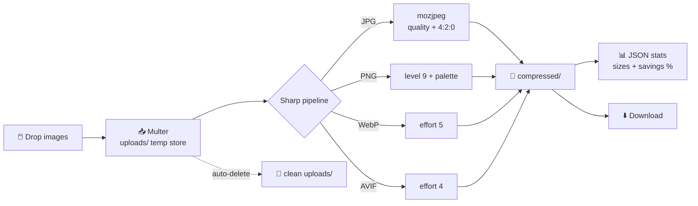

<div align="center">

# ⚡ PICO

### *TinyPNG Alternative — 100% Local, 100% Private*

**Local-first image compressor · Sharp-powered · Zero cloud · Zero telemetry**

[](https://www.npmjs.com/package/pico-img)
[](LICENSE)
[](https://nodejs.org)
[](https://www.npmjs.com/package/pico-img)
[](https://github.com/MoHamed-B-M/pico/stargazers)

[](https://github.com/MoHamed-B-M/pico/pulls)
[](https://github.com/MoHamed-B-M/pico/graphs/commit-activity)
[](#-why-pico)
[](#-why-pico)

</div>

---

## 📖 About

**Pico** is a free, open-source, **local-first image compression tool** built for developers
who care about privacy. Compress **JPG, JPEG, PNG, WebP, and AVIF** images directly on your
machine using a blazing-fast **Express + Sharp** pipeline — with a beautiful
**React + Tailwind CSS + GSAP** terminal-style web UI.

> 🔒 **Your images never leave localhost.** No uploads. No accounts. No limits. No tracking.
> Perfect for developers, designers, and anyone searching for a *TinyPNG alternative that
> respects privacy*, an *offline image optimizer*, or a *self-hosted image compressor CLI*.

---

## ✨ Features

| | Feature | Description |
|---|---|---|
| 🖼️ | **Drag & Drop UI** | Interactive dropzone with GSAP glow feedback and handwriting intro animation |
| 🎚️ | **Quality Control** | Real-time slider (10–100%) — from *tiny files* to *lossless-ish* |
| 🧬 | **Best-in-class Codecs** | `mozjpeg` for JPG, `compressionLevel: 9` + palette PNG, WebP & AVIF effort-tuned |
| 📦 | **Batch Processing** | Compress up to 30 images (25 MB each) in one request |
| 📊 | **Live Results** | Per-file before/after sizes, `−XX%` savings badges, instant downloads |
| 🧹 | **Auto Cleanup** | Temporary uploads deleted automatically — no disk bloat |
| 🔌 | **REST API** | `POST /api/compress` — scriptable from curl, scripts, CI pipelines |
| 💻 | **CLI + Web** | One command launches a local web app and opens your browser |

---

## 🚀 Quick Start

### ⚡ Instant run (no install)

```bash
npx pico-img
```

### 📦 Install globally (recommended)

```bash
npm install -g pico-img
pico
```

Your browser opens at **http://localhost:3000** automatically. That's it.

### 🛠️ From source (for contributors)

```bash
git clone https://github.com/MoHamed-B-M/pico.git
cd pico
npm install
npm run build     # builds the React frontend into client/dist
npm run dev       # dev server with HMR on :3000
```

### CLI options

```text
⚡ pico - Local Image Compressor

Usage: pico [options]

Options:
  -p, --port <number>   Port to serve on (default: 3000)
      --no-open         Do not auto-open the browser
  -h, --help            Show this help
```

---

## 🖥️ How to Use

1. **Launch** — run `pico` in any terminal
2. **Drop** — drag & drop images (or click *Choose files*) into the upload card
3. **Tune** — move the quality slider: `10` = tiny files · `75` = balanced · `100` = best fidelity
4. **Compress** — hit `[ COMPRESS ]` and watch the live pixel-grid loader
5. **Save** — review savings badges (`−79%`) and click `[ save ]` to download

---

## 📈 Real Benchmarks

Measured with the default pipeline on a 1600×1200 test image at quality 60:

| Format | Before | After | Saved |
|:------:|-------:|------:|:-----:|
| JPG | 1,823,679 B (1.82 MB) | 383,140 B (383 KB) | **−79%** |
| PNG | 113,649 B (113 KB) | 18,325 B (18 KB) | **−84%** |

---

## ⚙️ How It Works



All processing happens **in-process via libvips (Sharp)** — no external services,
no worker queues, no cloud functions. EXIF orientation is respected automatically.

---

## 🔌 REST API

### `POST /api/compress`

Multipart form: `images` (repeatable file field), `quality` (integer 10–100).

```bash
curl -X POST -F "images=@photo.jpg" -F "images=@graphic.png" -F "quality=60" \
  http://localhost:3000/api/compress
```

```json
{
  "success": true,
  "quality": 60,
  "files": [
    {
      "id": "d38c9894-fae2-4933-ba00-27f2fc496bea",
      "originalName": "photo-test.jpg",
      "downloadUrl": "/compressed/d38c9894…__photo-test.compressed.jpg",
      "format": "JPG",
      "quality": 60,
      "originalSize": 1823679,
      "compressedSize": 383140,
      "savedPercentage": 79
    }
  ]
}
```

Failed files are reported under `failures` without aborting the batch.
Health probe: `GET /api/health`.

---

## 📁 Project Structure

```text
pico-img/
├── server.js               # Express server & Sharp compression pipeline
├── vite.config.js          # Vite (root = client/, middleware mode for dev)
├── client/
│   ├── index.html
│   ├── tailwind.config.js
│   └── src/
│       ├── components/     # DoodleDropzone, QualitySlider, ResultsList, ui/
│       ├── animations/     # GSAP hooks (intro, stagger)
│       ├── tokens.css      # design tokens (phosphor terminal theme)
│       └── App.jsx
├── uploads/                # temp storage (auto-cleaned)
└── compressed/             # compressed output (served statically)
```

**Tech stack:** Node.js · Express · Sharp (libvips) · Multer · React 18 · Vite ·
Tailwind CSS · GSAP · framer-motion · opentype.js

---

## 🔍 Why Pico?

| | Pico | TinyPNG & cloud tools |
|---|---|---|
| Privacy | 🟢 100% local | 🔴 images uploaded to servers |
| Limits | 🟢 none | 🔴 ~20 images / batch caps |
| Cost | 🟢 free, MIT | 🟡 freemium / API pricing |
| Offline | 🟢 works | 🔴 requires internet |
| Tracking | 🟢 zero telemetry | 🔴 analytics |

**Keywords:** image compressor, image optimizer, compress jpg, compress png,
webp converter, avif compressor, tinypng alternative, local image compression,
privacy-first, offline tools, sharp nodejs, express image api, self-hosted,
image optimization cli, batch image compressor, developer tools.

---

## 🤝 Contributing

PRs are welcome! Fork → branch → commit → open a Pull Request.
Ideas: GIF support, resize presets, CLI-only batch mode, Docker image.

---

## 📄 License

[MIT License](LICENSE) © 2026 **Mohamed Ben Mohamed** — free for personal, educational,
and commercial use, provided the author is credited in copies and derivative works.

---

> **Disclaimer:** TinyPNG is a registered trademark of Tinify B.V. Pico is an independent, open-source project and is not affiliated with or endorsed by Tinify.

<div align="center">

## 👨‍💻 Made by Hamma

**IT Student · Developer · Privacy enthusiast**

[](mailto:benmohamedm715@gmail.com)
[](https://github.com/MoHamed-B-M)

⭐ **If Pico saved you disk space, please star the repo — it helps a lot!** ⭐


</div>
