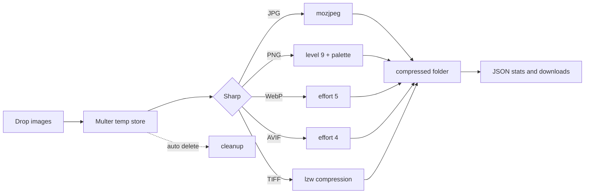

# Pico

A local-first image compressor for JPG, PNG, WebP, AVIF and TIFF. Pico runs a small Express server on your machine, compresses everything with Sharp, and shows the results in a terminal style web UI. Nothing is uploaded, there are no accounts, and nothing leaves your computer.

It exists because "free image compressor" usually means sending your photos to someone else's server. Pico does the same work offline.

[](https://www.npmjs.com/package/pico-img)
[](LICENSE)
[](https://nodejs.org)
[](https://github.com/MoHamed-B-M/pico/stargazers)
[](https://github.com/MoHamed-B-M/pico)
[](https://mohamed-b-m.github.io/pico/)

### Built with


### GitHub Insights

<p align="center">
  <a href="https://git.io/streak-stats">
    
  </a>
</p>

<p align="center">
  
  
  
</p>

<p align="center">
  
  
  
</p>

<p align="center">
  <a href="https://git.io/typing-svg">
    
  </a>
</p>

## Features

- Compresses JPG, JPEG, PNG, WebP, AVIF and TIFF, up to 25 MB per file and 30 files per batch
- Uses mozjpeg for JPEG, compression level 9 with palette mode for PNG, and tuned encoders for WebP and AVIF
- Quality control from 10 to 100, from tiny files to near-lossless
- Shows original size, compressed size and savings for every file
- Keeps the original format, respects EXIF orientation
- Deletes temporary uploads automatically after processing
- REST API if you prefer scripts over clicking

## Requirements

- Node.js 18.17 or newer
- A browser, for the web UI

## Installation

Run it once without installing:

```bash
npx pico-img
```

Or install it globally:

```bash
npm install -g pico-img
pico
```

The server starts on port 3000 and your browser opens automatically.

To work on the source code instead:

```bash
git clone https://github.com/MoHamed-B-M/pico.git
cd pico
npm install
npm run build
npm run dev
```

## Usage

1. Run `pico` in a terminal
2. Drag your images into the upload card, or click to browse
3. Pick a quality level. 10 gives the smallest files, 100 keeps the most detail
4. Press compress and wait for the results
5. Download what you need

### Command line options

```text
Usage: pico [options]

Options:
  -p, --port <number>   Port to serve on (default: 3000)
      --no-open         Do not auto-open the browser
  -h, --help            Show this help
```

## How it works



Compression happens in-process through libvips. There are no workers, queues or external services involved.

## Results you can expect

Measured on a 1600x1200 test image at quality 60:

| Format | Before | After | Saved |
|--------|-------:|------:|------:|
| JPG | 1.82 MB | 383 KB | 79% |
| PNG | 113 KB | 18 KB | 84% |

## API

Compress files with a POST request. The `images` field is repeatable, `quality` accepts an integer from 10 to 100.

```bash
curl -X POST -F "images=@photo.jpg" -F "quality=60" http://localhost:3000/api/compress
```

The response contains one entry per file:

```json
{
  "success": true,
  "quality": 60,
  "files": [
    {
      "id": "d38c9894",
      "originalName": "photo.jpg",
      "downloadUrl": "/compressed/d38c9894__photo.compressed.jpg",
      "format": "JPG",
      "quality": 60,
      "originalSize": 1823679,
      "compressedSize": 383140,
      "savedPercentage": 79
    }
  ]
}
```

Files that fail are listed under `failures` and do not stop the rest of the batch. A health probe is available at `GET /api/health`.

## Project structure

```text
pico/
|-- server.js               Express server and Sharp pipeline
|-- vite.config.js          Vite config, client root
|-- client/
|   |-- index.html
|   |-- tailwind.config.js
|   +-- src/
|       |-- components/     Upload card, quality slider, results
|       |-- animations/     GSAP hooks
|       |-- tokens.css      Design tokens
|       +-- App.jsx
|-- uploads/                Temporary storage, auto cleaned
+-- compressed/             Output folder, served statically
```

## Contributing

Pull requests are welcome. Fork the repo, make your changes, and open a PR. Some ideas that would be nice: resize presets, a CLI-only batch mode, GIF support, a Docker image.

## License

This project is licensed under the MIT license with an attribution clause. See [LICENSE](LICENSE) for details.

## Author

Made by Hamma, IT student.

[](mailto:benmohamedm715@gmail.com)
[](https://github.com/MoHamed-B-M)

Disclaimer: TinyPNG is a registered trademark of Tinify B.V. Pico is an independent, open-source project and is not affiliated with or endorsed by Tinify.
